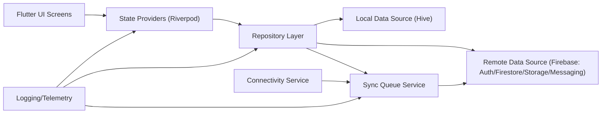
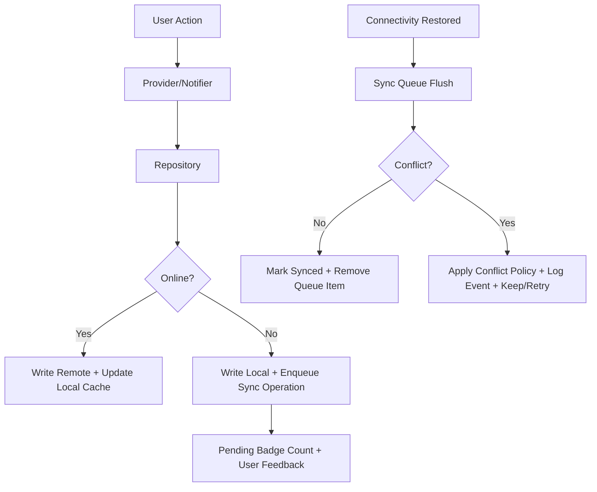

# Nigeria Healthcare App - End-to-End Master Delivery Plan

## 0. Purpose of This Document

This is the single execution plan for completing the project from current state to production launch.

Audience:
- Primary executor: lower-capability agent (Ollama/Qwen)
- Reviewer: project owner

This document is intentionally explicit and operational. Follow it step-by-step.

---

## 1. Non-Negotiable Rules (Read First)

1. Do not apply model-corrupting edits.
2. Do not convert normal constructors into `factory` constructors unless there is a valid design reason and tests prove correctness.
3. Do not remove Hive `part` directives from model files.
4. Do not delete model fields without an explicit migration plan.
5. Do not rename domain entities unless a full propagation pass is included (models, providers, repositories, UI, tests, adapters).
6. Do not commit generated files blindly; inspect generated output and run analyzer/tests.
7. Every phase must end with verification evidence:
   - `flutter pub get`
   - `flutter analyze`
   - required tests for phase

---

## 2. Current State Snapshot (What Has Already Been Done)

Completed:
- Flutter project root/scaffold restored.
- Repository layer foundation added:
  - `UserRepository`, `ProviderRepository`
- Riverpod wiring updated to use repository boundaries for key flows.
- Offline sync queue service implemented:
  - queue enqueue for user/provider/appointment upserts
  - flush on connectivity restore
  - pending count stream provider
  - manual flush trigger
- Sync status badge wired into app bars.
- Analyzer warnings cleaned; currently analyzer passes.
- `PROJECT_STATE.md` created for architecture context.

Known remaining scope:
- Harden Firebase integration and rule model.
- Complete offline-first conflict strategy.
- Add CI/CD and release automation.
- Add test pyramid (unit/integration/UAT).
- Implement missing feature depth (appointments, records, auth lifecycle).
- Production readiness (security, observability, performance, stores, marketing assets).

---

## 3. Final Product Vision (Launch Definition)

Launch-ready means:
- Reliable patient-facing app (mobile + web baseline)
- Authenticated access with role-aware behavior
- Provider discovery with robust filtering + detail views
- Appointment lifecycle end-to-end
- Health records upload/view/share
- Symptom triage with clear risk disclaimers and escalation
- Offline queue sync with transparent user feedback
- Secure Firebase backend rules and monitoring
- CI/CD pipelines with quality gates
- Deployment environments (dev/staging/prod)
- Launch assets (screenshots, branding, app store readiness, landing page copy)

---

## 4. System Architecture (Target)

### 4.1 Layered Architecture

### 4.2 Runtime Data Flow (Online/Offline)

### 4.3 Services Inventory (Target Components)

- App/UI:
  - Feature screens, shared widgets, navigation, forms
- State:
  - Riverpod providers/notifiers
- Domain:
  - `User`, `HealthcareProvider`, `Appointment`, `HealthRecord`, `SymptomRecord`
- Repositories:
  - Auth/User repo
  - Provider repo
  - Appointment repo
  - Health record repo
  - Symptom repo
- Local:
  - Hive boxes, adapters, encryption
- Remote:
  - FirebaseAuth, Firestore, Storage, Messaging
- Sync:
  - queue, retry, dedup, conflict policy, status surfaces
- Platform:
  - CI/CD, secrets, observability, alerts

---

## 5. SDLC Role Matrix (What To Do by Role)

## 5.1 Product Owner

- Define MVP feature acceptance criteria per module.
- Freeze v1 scope (avoid feature creep).
- Create launch checklist and release sign-off criteria.
- Prioritize backlog:
  1. Reliability/security
  2. Core flows
  3. Quality + release
  4. Growth/marketing

Deliverables:
- `docs/PRODUCT_REQUIREMENTS.md`
- `docs/MVP_ACCEPTANCE_CRITERIA.md`
- `docs/RELEASE_SIGNOFF.md`

## 5.2 UI/UX Designer

- Finalize design tokens (typography/color/spacing/components/states).
- Create screens for:
  - Auth
  - Home
  - Provider search/detail
  - Appointment booking + management
  - Health records
  - Symptom checker
  - Offline + sync status states
- Define empty/loading/error/offline states for each screen.

Deliverables:
- `docs/DESIGN_SYSTEM.md`
- `docs/UX_STATES_MATRIX.md`

## 5.3 Frontend/Mobile Developer

- Convert all major screens to repository-backed data.
- Remove static sample data from UI where production paths exist.
- Add robust form validation and UX feedback.
- Ensure adaptive layouts for phone/tablet/web.
- Add accessibility labels and focus order.

Deliverables:
- Complete screen implementations
- Widget tests for key flows

## 5.4 Backend/Cloud Engineer

- Implement remote data sources for all repositories.
- Ensure Firestore schema consistency.
- Add Cloud Functions for protected operations if needed:
  - trusted write pathways
  - notifications
  - async business logic

Deliverables:
- `lib/core/datasources/remote/*`
- `functions/` (if used)
- schema doc

## 5.5 Database Administrator (Firestore/Hive)

- Define Firestore collections/doc structures and indexes.
- Define migration strategy for model version changes.
- Validate Hive typeIds and field ordering stability.
- Plan backup/restore procedures.

Deliverables:
- `docs/DATA_MODEL.md`
- `docs/MIGRATIONS.md`
- `firestore.indexes.json`

## 5.6 DevOps / Platform Engineer

- Add CI pipeline with required checks:
  - format/lint/analyze
  - unit tests
  - integration tests (selective)
  - build checks
- Add CD workflow for staging and production.
- Add environment config matrix.

Deliverables:
- `.github/workflows/ci.yml`
- `.github/workflows/deploy_staging.yml`
- `.github/workflows/deploy_prod.yml`
- `docs/ENVIRONMENTS.md`

## 5.7 DevSecOps Engineer

- Security review of auth and data flow.
- Firestore security rules implementation and tests.
- Secret management and key rotation policy.
- Encrypt Hive boxes with key management.

Deliverables:
- `firestore.rules`
- rules unit tests
- `docs/SECURITY_BASELINE.md`

## 5.8 QA + UAT Team

- Define test plans for all MVP flows.
- Automate smoke and regression suites.
- Run UAT scripts and gather sign-off.

Deliverables:
- `docs/TEST_PLAN.md`
- `integration_test/` scenarios
- `docs/UAT_SIGNOFF.md`

## 5.9 Digital Marketer + Product Photographer

- Prepare launch visual assets:
  - app screenshots (phone/tablet/web)
  - feature banners
  - social launch creatives
- Create landing page and release messaging.
- App store metadata drafts.

Deliverables:
- `assets/marketing/`
- `docs/LAUNCH_MESSAGING.md`
- `docs/STORE_LISTING_CONTENT.md`

## 5.10 Virtual Assistant / PMO Support

- Keep daily execution log.
- Track blockers and decision register.
- Ensure every merged change maps to milestone.

Deliverables:
- `docs/DAILY_EXECUTION_LOG.md`
- `docs/DECISION_LOG.md`

---

## 6. Phase-by-Phase Execution Plan

## Phase 1 - Stabilize Architecture Boundaries

Objective:
- Complete repository pattern for all domains.

Tasks:
1. Add repositories:
   - AppointmentRepository
   - HealthRecordRepository
   - SymptomRepository
2. Add local/remote data source interfaces and implementations.
3. Refactor notifiers/services to consume repositories only.
4. Remove direct Firestore/Hive calls from UI.

Acceptance:
- No UI layer direct access to storage or firestore classes.
- Analyzer and tests pass.

---

## Phase 2 - Harden Firebase Integration

Objective:
- Secure and resilient remote layer.

Tasks:
1. Implement auth guard helpers:
   - requireAuthenticatedUser
   - role checks
2. Standardize firebase error mapping:
   - network
   - permission
   - validation
   - server unknown
3. Add Firestore rules:
   - least privilege
   - per-user data isolation
   - role restrictions for provider writes
4. Add Firestore rule tests.
5. Add idempotent upsert patterns for queue replay.

Acceptance:
- Rule tests pass.
- Unauthorized actions fail as expected.

---

## Phase 3 - Complete Offline-First Sync

Objective:
- Reliable local-first behavior under flaky network.

Tasks:
1. Queue enhancements:
   - operation id
   - retry count
   - backoff metadata
   - dead-letter handling
2. Conflict policies per entity:
   - User profile: last-write-wins + timestamp
   - Appointment status: server-authoritative state machine
   - HealthRecord metadata: merge + preserve file refs
3. Sync telemetry:
   - last sync time
   - pending count
   - failed operation count
4. UX states:
   - syncing
   - pending
   - failed (tap retry)
5. Background sync trigger on app resume.

Acceptance:
- Offline create/update works.
- Reconnect flush succeeds with deterministic results.

---

## Phase 4 - Complete Core Features

Objective:
- Make all MVP user flows real.

Tasks:
1. Authentication:
   - email/phone flows
   - persistent session
   - logout cleanup
2. Provider Search:
   - remote fetch
   - filters/sort
   - provider detail page
3. Appointments:
   - booking/reschedule/cancel
   - status transitions
   - upcoming/past/cancelled tabs
4. Health Records:
   - upload to Firebase Storage
   - metadata to Firestore
   - list/download/share links
5. Symptom Checker:
   - service boundary
   - safe disclaimer text
   - save records history

Acceptance:
- All primary flows functional in staging.

---

## Phase 5 - Security and Compliance Baseline

Objective:
- Reduce production risk.

Tasks:
1. Encrypt Hive at rest.
2. Secure secret handling:
   - no hardcoded API keys in tracked files
   - environment-based config
3. PII logging redaction.
4. Threat model and abuse cases.
5. Audit dependency vulnerabilities.

Acceptance:
- Security checklist signed.
- No critical issues open.

---

## Phase 6 - Observability and Reliability

Objective:
- Operate app in production confidently.

Tasks:
1. Structured logging.
2. Crash reporting integration.
3. Metrics:
   - auth success/failure
   - sync success/failure
   - provider search latency
4. Alerts on error thresholds.
5. Health dashboard doc.

Acceptance:
- On-call runbook exists.
- Alerts tested.

---

## Phase 7 - Test Coverage and Quality Gates

Objective:
- Confidence in releases.

Tasks:
1. Unit tests for repositories/sync/policies.
2. Widget tests for key screens.
3. Integration tests:
   - offline queue replay
   - appointment lifecycle
4. Golden screenshots (optional but recommended).
5. Regression suite in CI.

Acceptance:
- Minimum target:
  - 70% service/repository coverage
  - all critical flows tested

---

## Phase 8 - CI/CD and Environment Strategy

Objective:
- Deterministic build and release process.

Tasks:
1. Create environment configs:
   - dev
   - staging
   - prod
2. Add CI workflow:
   - install
   - analyze
   - test
   - build
3. Add CD workflows:
   - staging deploy
   - production release with manual approval
4. Add versioning and changelog automation.

Acceptance:
- PR checks required.
- One-click staging release works.

---

## Phase 9 - Product Surface Finalization (UX + Content + Assets)

Objective:
- Launch-quality UX and assets.

Tasks:
1. Final pass on copywriting and microcopy.
2. Empty/loading/error/offline state polish.
3. Prepare production images:
   - app screenshots for app stores
   - landing visuals
   - social media launch cards
4. Optimize image assets:
   - responsive sizes
   - compression
   - caching strategy
5. Accessibility QA:
   - contrast
   - text scaling
   - screen-reader labels

Acceptance:
- UX sign-off complete.
- Marketing asset package complete.

---

## Phase 10 - UAT, Pre-Launch, and Go-Live

Objective:
- Safe production launch.

Tasks:
1. UAT scripts with non-technical testers.
2. Fix critical/high issues.
3. Pre-launch checklist:
   - env vars
   - firebase configs
   - rules deployed
   - indexes deployed
   - rollback plan
4. Launch and monitor first 72 hours.
5. Post-launch retrospective.

Acceptance:
- Go/No-Go approved.
- Production issues within acceptable threshold.

---

## 7. Technical Backlog (Explicit Task List for Qwen Agent)

1. Create `lib/core/datasources/local/` and `lib/core/datasources/remote/`.
2. Move all Firestore calls from ad-hoc service files into remote data sources.
3. Implement repositories for appointments/records/symptoms.
4. Add DTO/domain mappers where needed.
5. Add operation-level sync retry policy with exponential backoff.
6. Add queue dead-letter and diagnostics screen.
7. Add encryption key management for Hive.
8. Add Firebase App Check and stricter auth assertions.
9. Write Firestore security rules and tests.
10. Add complete integration tests for offline/online transitions.
11. Add CI/CD workflows.
12. Add release docs and runbooks.
13. Add production image pipeline and compressed assets.
14. Add launch marketing pack.

---

## 8. Explicit Image Handling Plan (Production Capacity)

Image categories:
- Profile photos
- Provider banners
- Health record attachments
- Marketing screenshots

Rules:
1. Enforce max upload size and accepted formats.
2. Generate multiple sizes:
   - thumbnail
   - medium
   - original
3. Store with deterministic naming:
   - `{entity}/{id}/{timestamp}_{variant}.jpg`
4. Add signed URL handling if private.
5. Cache strategy:
   - CDN cache-control headers
   - app-side cached network images
6. Add cleanup jobs for orphaned files.
7. Add metadata table/collection for traceability.

Acceptance:
- No unbounded storage growth.
- Fast image load on mobile networks.

---

## 9. Definition of Done (Per Feature)

A feature is done only if:
1. Product behavior implemented.
2. Repository + data source boundaries respected.
3. Offline behavior defined and tested.
4. Error states handled and user-visible.
5. Unit and widget/integration tests added.
6. Security implications reviewed.
7. Analyzer and CI pass.
8. Documentation updated.

---

## 10. Risk Register (Top Risks + Mitigations)

1. Data inconsistency (offline vs remote)
- Mitigation: operation ids, deterministic conflict policy, replay tests.

2. Security misconfiguration in Firestore rules
- Mitigation: rules tests + staged rollout.

3. Performance regressions on low-end devices
- Mitigation: profiling, lazy loading, image optimization.

4. Scope creep
- Mitigation: MVP acceptance criteria lock.

5. Release instability
- Mitigation: CI gates + staged deploy + rollback docs.

---

## 11. Daily Execution Protocol for Qwen Agent

Every day:
1. Read this file + `PROJECT_STATE.md`.
2. Pick one milestone sub-slice.
3. Implement small coherent change set.
4. Run:
   - `flutter pub get`
   - `flutter analyze`
   - relevant tests
5. Update:
   - `docs/DAILY_EXECUTION_LOG.md`
   - `docs/DECISION_LOG.md`
6. Commit with scoped message:
   - `feat(repo): ...`
   - `fix(sync): ...`
   - `chore(ci): ...`

Do not bundle unrelated changes in one commit.

---

## 12. Final Launch Checklist

Engineering:
- [ ] Analyzer clean
- [ ] Tests green
- [ ] CI passing
- [ ] Security rules deployed
- [ ] Backups and rollback tested

Product:
- [ ] UAT signed
- [ ] Core flows validated
- [ ] Copy/content approved

Operations:
- [ ] Monitoring live
- [ ] Alert routing verified
- [ ] Incident runbook published

Growth:
- [ ] Marketing assets ready
- [ ] Store listing ready
- [ ] Launch announcement ready

---

## 13. Immediate Next Action (Starting Tomorrow)

Start with Phase 2 and Phase 3 hardening in this order:
1. Firestore rules + tests.
2. Sync queue retry/backoff/dedup.
3. Appointment/record repositories completion.
4. Integration tests for offline replay.

Only after those pass, proceed to CI/CD and launch packaging.

